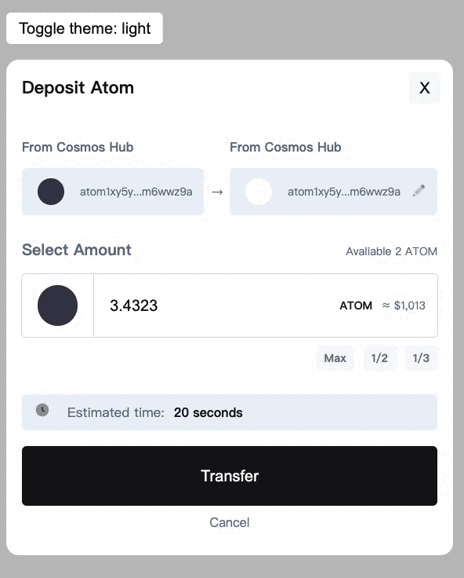

# Atom Deposit Modal

This project can be theme transition as below:

## How to start this project

this project is build by Vite + React + Typescript

It's only clone this project into local and run `npm install`

and `npm run dev`, open the `http://localhost:5173/` in browser to see it.

## How to build this project

run `npm run build` and drop the `dist` folder into your server.

## source code

in `src/App.tsx` use `styled compoent` to build the UI

## my self introduction audio

<audio src="./self-introduction-audio.mp3" controls="controls"></audio>

## my CV

<a href="./Kyle_Yu_CV_Full-stack_7_yrs_exp.docx" download="CV.pdf">download my CV</a>
